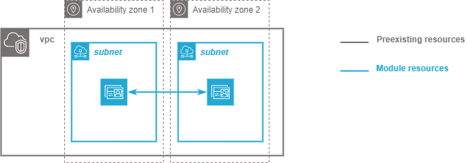

.. image:: docs/imgs/logo.png
   :alt: Logo

==========================
AWS directory terraform module
==========================

About The Project
=================

This project contains all the infrastructure as code (IaC) to deploy a directory in AWS

.. image:: https://badgen.net/github/checks/nadegelemperiere-aws/module-aws-directory
   :target: https://github.com/nadegelemperiere-aws/module-aws-directory/actions/workflows/release.yml
   :alt: Status
.. image:: https://img.shields.io/static/v1?label=license&message=MIT&color=informational
   :target: ./LICENSE
   :alt: License
.. image:: https://badgen.net/github/commits/nadegelemperiere-aws/module-aws-directory/main
   :target: https://github.com/nadegelemperiere-aws/robotframework
   :alt: Commits
.. image:: https://badgen.net/github/last-commit/nadegelemperiere-aws/module-aws-directory/main
   :target: https://github.com/nadegelemperiere-aws/robotframework
   :alt: Last commit

Built With
----------

.. image:: https://img.shields.io/static/v1?label=terraform&message=1.6.4&color=informational
   :target: https://www.terraform.io/docs/index.html
   :alt: Terraform
.. image:: https://img.shields.io/static/v1?label=terraform%20AWS%20provider&message=5.26.0&color=informational
   :target: https://registry.terraform.io/providers/hashicorp/aws/latest/docs
   :alt: Terraform AWS provider

Getting Started
===============

Prerequisites
-------------

2 subnets shall have been defined in different availability zone to ensure directory redundancy.

Configuration
-------------

To use this module in a wider terraform deployment, add the module to a terraform deployment using the following module:

.. code:: terraform

    module "directory" {

        source      = "git::https://github.com/nadegelemperiere-aws/module-aws-directory?ref=<this module version"
        project     = the project to which the permission set belongs to be used in naming and tags
        module      = the project module to which the permission set belongs to be used in naming and tags
        email       = the email of the person responsible for the permission set maintainance
        environment = the type of environment to which the permission set contributes (prod, preprod, staging, sandbox, ...) to be used in naming and tags
        git_version = the version of the deployment that uses the permission sets to be used as tag
        vpc         = {
            id       = the aws id of the virtual private cloud in which the directory shall be deployed
        }
        subnets     = [
           { id       = identifier of the subnet on which the directry shall be deployed }
        ]
        directory   = {
            domain   = name of the domain to give to the directory
            secret   = secret to secure the directory access
            type     = directory type (see https://registry.terraform.io/providers/hashicorp/aws/latest/docs/resources/directory_service_directory#type) for more details
            size     = directory size (see https://registry.terraform.io/providers/hashicorp/aws/latest/docs/resources/directory_service_directory#size) for more details
        }
        logging     = {
            arn      = arn of the logggroup to use for log storage
            name     = name of the loggroup to use for log storage
        }
    }

Usage
-----

The module is deployed alongside the module other terraform components, using the classic command lines :

.. code:: bash

    terraform init ...
    terraform plan ...
    terraform apply ...

Detailed design
===============

Module creates a directory to receive identities. Directory is located on 2 subnets to ensure high availability.

Logging in cloudwatch loggroup is activated if possible : logging can not be enabled on directory of type SmallAD, and therefore the logging variables shall not be set when configuring this AD type.

Testing
=======

Tested With
-----------

.. image:: https://img.shields.io/static/v1?label=aws_iac_keywords&message=v1.5.0&color=informational
   :target: https://github.com/nadegelemperiere-aws/robotframework
   :alt: AWS iac keywords
.. image:: https://img.shields.io/static/v1?label=python&message=3.12&color=informational
   :target: https://www.python.org
   :alt: Python
.. image:: https://img.shields.io/static/v1?label=robotframework&message=6.1.1&color=informational
   :target: http://robotframework.org/
   :alt: Robotframework
.. image:: https://img.shields.io/static/v1?label=boto3&message=1.29.3&color=informational
   :target: https://boto3.amazonaws.com/v1/documentation/api/latest/index.html
   :alt: Boto3

Environment
-----------

Tests can be executed in an environment :

* in which python and terraform has been installed, by executing the script `scripts/robot.sh`_, or

* in which docker is available, by using the `aws infrastructure image`_ in its latest version, which already contains python and terraform, by executing the script `scripts/test.sh`_

.. _`aws infrastructure image`: https://github.com/nadegelemperiere-docker/terraform-python-awscli
.. _`scripts/robot.sh`: scripts/robot.sh
.. _`scripts/test.sh`: scripts/test.sh

Strategy
--------

The test strategy consists in terraforming test infrastructures based on the directory module and check that the resulting AWS infrastructure matches what is expected.
The tests currently contains 1 test :

1 - A test to check the capability to create a Small AD directory based on the module.

The tests cases :

* Apply terraform to deploy the test infrastructure

* Use specific keywords to model the expected infrastructure in the boto3 format.

* Use shared Directory keywords to check that the boto3 input matches the expected infrastructure

NB : It is not possible to completely specify the expected infrastructure, since some of the value returned by boto are not known before apply. The comparaison functions checks that all the specified data keys are present in the output, leaving alone the other undefined keys.

Results
-------

The test results for latest release are here_

.. _here: https://nadegelemperiere-aws.github.io/module-aws-directory/report.html

Issues
======

.. image:: https://img.shields.io/github/issues/nadegelemperiere-aws/module-aws-directory.svg
   :target: https://github.com/nadegelemperiere-aws/module-aws-directory/issues
   :alt: Open issues
.. image:: https://img.shields.io/github/issues-closed/nadegelemperiere-aws/module-aws-directory.svg
   :target: https://github.com/nadegelemperiere-aws/module-aws-directory/issues
   :alt: Closed issues

Roadmap
=======

N.A.

Contributing
============

.. image:: https://contrib.rocks/image?repo=nadegelemperiere-aws/module-aws-directory
   :alt: GitHub Contributors Image

We welcome contributions, do not hesitate to contact us if you want to contribute.

License
=======

This code is under MIT License.

Contact
=======

Nadege LEMPERIERE - nadege.lemperiere@gmail.com

Acknowledgments
===============

N.A.
